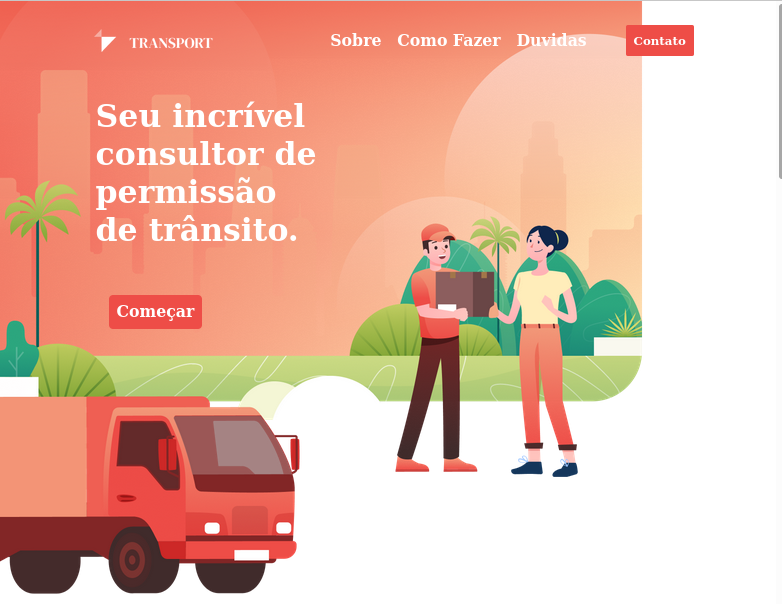

# Challange
projeto proposto em desafio Dh, e um breve monolito com front e back e banco em Mysql
>`Desenvolvimento proprio` apenas o design que foi passado pego de template do figma

## preview
Mobile
<br>


Desktop
<br>


## ATENÇÂO
```diff
- e de suma importancia que voçe tenha o banco de dados Mysql instalado em sua maquina 
! pois e nele que seram armazenadoas a informações repassadas pelo front como nome, email e mensagem

! nao esquece de criar as tabelas de acordo com os models pra que ai sim tenha o funcionamento perfeito
```

## instalacao
```
npm install
```
## executar 
```
npm run dev
```

> visualizacao em [http://localhost:3000](http://localhost:3000)

E nessesario ter instalado o banco de dados mysql 
- criar um banco(database) com o nome `challenge_fullstack`
- o usuario padrao nao deve ter senha, se tiver por favor subistitua o password no arquivo `src/confi/configDB.js` por a senha que voce ultiliza.
- caso nao saiba instalar ou esteja tendo dificuldades acesse este [link](https://github.com/LeoScripts/Mysql-Postgresql-MongoDB-Sequelize/blob/main/Mysql.md) e siga o passo a passo(obs: esta instalacao e em linux) 
